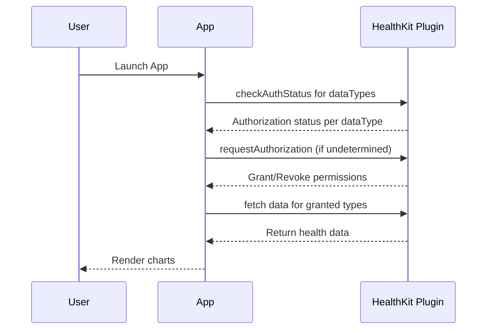
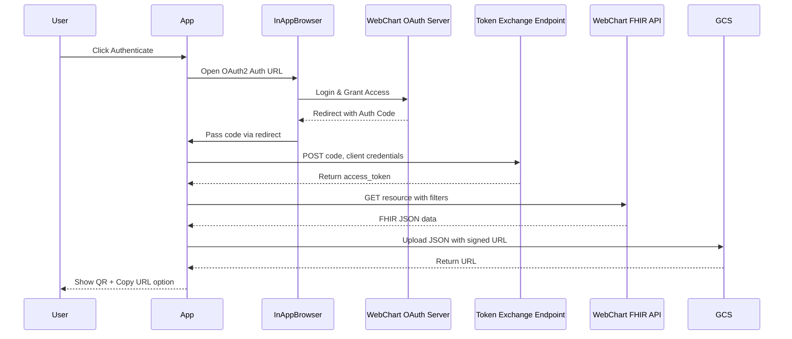
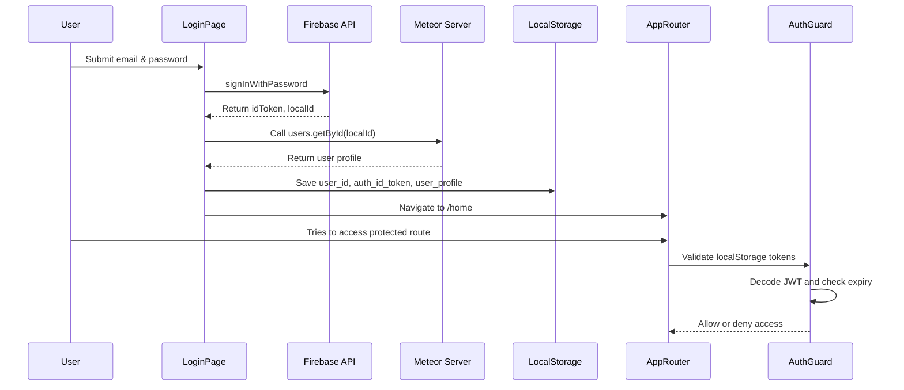

# MIE MOBILE HEALTH APP
## Virtual FHIR Records and SMART Card Companion


## Overview

This mobile application is a patient-centric health data companion inspired by the CommonHealth App. Built using Meteor, React, and Cordova, the app allows users to securely access, view, and share their health data—including SMART Health Cards and EHR-derived FHIR records—on the go. It integrates with:

- Firebase for user authentication
- MongoDB Atlas for data persistence
- Apple HealthKit to retrieve and display personal health metrics
- WebChart EHR for SMART-on-FHIR data retrieval
- Google Cloud Storage for profile and JSON file management
- LocalForage for offline access

---

## Features

### Authentication
- Firebase Authentication: Sign up, login, and logout.
- JWT Validation: Secure route access using authGuard.js with JWT expiry checks.

### HealthKit Integration
- Fetches data types such as: Calories Burned, Heart Rate, BMI, Steps, Movement Distance etc.
- Permission Management with fallback to iOS settings
- Graphical Visualization using bar charts, line graphs, and gauges
- Device validation through sourceBundleId comparison
- The charts are displayed using the library - "chart.js".

### Profile Page
- View and update personal details
- Upload profile picture to GCS bucket mie_fhir_mobile_app
- Log out functionality

### SMART Card Scanner
- Scan and decode SMART Health Cards via QR code
- Preview and store card data in MongoDB
- Display stored cards with filtering and deletion support
- View QR code and card metadata

### FHIR Data Retrieval via SMART-on-FHIR
- Authenticate using OAuth2 SMART on FHIR (WebChart)
- Retrieve any FHIR resourceType (Condition, Medication, etc.) with filters
- View fetched FHIR cards and apply filters (by type, date, keywords)
- Export cards as downloadable QR-based JSON links

### FHIR Export Feature
- Converts FHIR resources into JSON files
- Stores them temporarily in bucket mie_fhir_mobile_app_fhir_jsons using signed GCS URLs
- Displays links and QR codes for easy hospital/provider sharing

### Automated Cleanup
- Cloud Function (imports/cloud_functions/clearbucket) clears temporary JSON files
- Scheduled daily run via Cloud Scheduler to prevent persistent storage

### Offline Access
- Uses LocalForage to cache SMART cards and FHIR cards locally
- Offline data preview with toast message when data is retrieved from local cache

---

## Requirements

- Node.js & Meteor installed
- Android/iOS device with Cordova support
- Firebase project + API Key
- MongoDB Atlas account
- Google Cloud Storage buckets:
-> mie_fhir_mobile_app
-> mie_fhir_mobile_app_fhir_jsons
- WebChart EHR OAuth2 client credentials

Cordova Plugins:
- cordova-plugin-camera
- cordova-plugin-firebase-authentication
- cordova-plugin-health
- cordova-plugin-inappbrowser
- cordova-plugin-x-toast
- phonegap-plugin-barcodescanner

---

## Setup Instructions

1. Install Meteor:
```bash
curl https://install.meteor.com/ | sh
```

2. Clone the Repository & Install Dependencies:
```bash
git clone <repo-url>
cd <project-folder>
npm install
```

3. Set Up Environment Variables:
Set up a file in "credentials/secrets.js" and declare these variables
```js
FIREBASE_API_KEY=<your_firebase_key>
CLIENT_SECRET=<your_webchart_client_secret>
```

4. In credentials directory insert your key.json(for firbase)
5. Declare Google credentials to get this key.json:
```js
export GOOGLE_APPLICATION_CREDENTIALS="<path_example>/MIE_EHR_ACCESS_MOBILE_APPLICATION/EHR_application/credentials/key.json"
```

6. Run Locally:
```bash
meteor run ios-device
# or
meteor run android-device
```

## Folder Structure Highlights:
- imports/cloud_functions/clearbucket: Daily GCS bucket cleanup logic
- imports/ui: React pages (Overview, QRScanner, Profile, EHR Retrieval)
- imports/api: Meteor server methods and MongoDB collections
- credentials/secrets.js: Firebase & WebChart secrets

## Demo Video


## Workflow Diagrams

### HealthKit Permission & Data Fetch


### SMART-on-FHIR Retrieval & Export


### Firebase Authentication & Auth Guard



